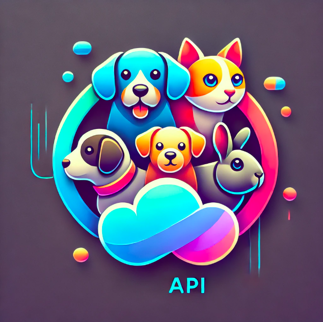
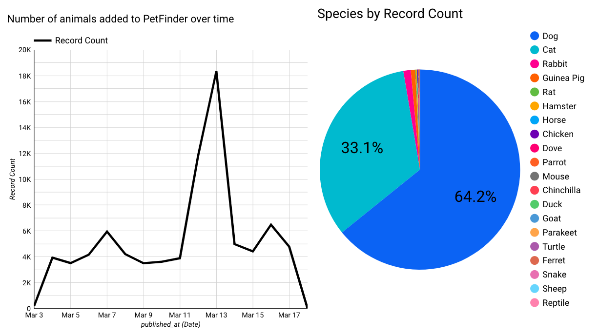

# :paw_prints: PetFinder API Data Pipeline



*Image Created Using AI

---

[](https://www.python.org/)
[](https://opensource.org/licenses/MIT)
[](https://www.petfinder.com/developers/)
[](https://cloud.google.com/)
[](https://cloud.google.com/bigquery)
[](https://github.com/features/actions)
[](https://www.terraform.io/)
[](https://www.getdbt.com/)
[](https://cloud.google.com/looker)
[](https://github.com/)


## 📖 Evaluation Criteria as Table of Contents

**Based on Project rubric**
- [:question: Problem Description](#question-problem-description)
- [:building_construction: Pipeline Architecture](#building_construction-pipeline-architecture)
- [:cloud: Cloud](#cloud-cloud)
- [:violin: Batch / Workflow Orchestration](#violin-batch--workflow-orchestration)
- [:file_cabinet: Data Warehouse](#file_cabinet-data-warehouse)
- [:arrows_counterclockwise: Transformations](#arrows_counterclockwise-transformations)
- [:rocket: Dashboard Visualization](#rocket-Dashboard-visualization)
- [:wrench: Technologies Used](#wrench-technologies-used)
- [:bulb: Lessons Learned](#bulb-lessons-learned)
- [:recycle: Reproducibility / Setup Instructions](#recycle-reproducibility--setup-instructions)

---

TODO - Backfill, add log, ok, could adjust api to end for date of. Add how-to to gitbook! Add subsections.

https://lookerstudio.google.com/embed/reporting/eab4cbae-a022-470a-88dc-15de1ab4a255/page/oenBF


## :question: Problem description

The **problem** is the challenge of handling, processing, and visualizing pet adoption data from
[Pet Finder API](https://www.petfinder.com/developers/v2/docs/) in an automated, 
scalable, and efficient manner. The **solution** is an end-to-end data pipeline leveraging 
**Python, Terraform, DBT, Google BigQuery, and Google Cloud Storage**, with workflow automation via **GitHub Actions**.

## :building_construction: Pipeline Architecture

The architecture of the data pipeline involves several components:

1. **Data Ingestion**: Extracting pet adoption data from the PetFinder API using Python. Automated with Github Actions daily batch cron job.
2. **Storage & Processing**: Using **Google Cloud Storage (GCS) as a data lake** and **Python with Terraform** for automation.  
3. **Data Warehousing**: Moving processed data from GCS to **Google BigQuery** using Python.  
4. **Data Transformation**: Using **DBT** to clean, model, and optimize data by processing and transforming the data for meaningful insights using partitioning and clustering. 
5. **Visualization**: Creating a **Google Data Studio Looker dashboard** with 2 tiles of insights on pet adoption trends.  
6. **Automation**: Using **GitHub Actions** yml file for automated daily cron batch processing.


:warning: Note that the user must manually create an account for [PetFinder API](https://www.petfinder.com/developers/v2/docs/), 
add Github Secrets, and create a Google Cloud account. 

## :cloud: Cloud

This project utilizes Google Cloud Platform (GCP) services including Google Cloud Storage (GCS) Data Lake
and BigQuery Data Warehouse for data storage and processing. This project uses Terraform `Infrastructure as Code (IaC)` to automate 
the setup and management of cloud resources including the GCP bucket for the data lake.

## :violin: Batch / Workflow orchestration

This project uses Github Actions to run batches daily. The workflow orchestration pipeline is:

- Automatically ingesting daily data from the API into the cloud storage (data lake).
- Moving data from the data lake to BigQuery (data warehouse).
- Transforming data using dbt.
- Visualizing data in Looker.

---

### :question: What is Github Actions? 

In your GitHub Repo, you can find 'Actions' by looking for the tab with the forward arrow :arrow_forward:

In this project, GitHub Actions is used to automate daily batch jobs by setting up a workflow with a cron schedule that 
runs at a specific time each day. This is done using the on: schedule event in a workflow YAML file. 
Inside the workflow, jobs are defined with steps that execute scripts, run commands, or trigger external services.
This daily batch job fetches data from an API, process it, and stores the results in google cloud storage. 
The automation ensures that tasks run consistently without manual intervention.

## :file_cabinet: Data warehouse

This project uses BigQuery for the data warehouse and the tables are partitioned and clustered. For the petfinder
dataset, I partition by processed date, and then cluster by species, age group, and state.

## :arrows_counterclockwise: Transformations 

The **DBT** transformations take place in **BigQuery**, where raw data is cleaned and prepared for analysis.
The transformation script is as follows:

```SQL

-- models/transformations/transformed_petfinder.sql
{{ config(
    materialized='table',
    partition_by={'field': 'published_at', 'data_type': 'TIMESTAMP'},
    cluster_by=['species', 'age_group', 'state']
) }}

WITH cleaned_data AS (
    SELECT
        id,
        name,
        species,
        age,
        gender,
        size,
        primary_breed,
        primary_color,
        CAST(spayed_neutered AS BOOL) AS spayed_neutered,
        CAST(house_trained AS BOOL) AS house_trained,
        CAST(declawed AS BOOL) AS declawed,
        CAST(special_needs AS BOOL) AS special_needs,
        CAST(shots_current AS BOOL) AS shots_current,
        CAST(good_with_children AS BOOL) AS good_with_children,
        CAST(good_with_dogs AS BOOL) AS good_with_dogs,
        CAST(good_with_cats AS BOOL) AS good_with_cats,
        tags,
        location,
        SPLIT(location, ', ')[SAFE_OFFSET(0)] AS city,
        SPLIT(location, ', ')[SAFE_OFFSET(1)] AS state,
        postcode,
        published_at,
        organization_id,
        email,
        CASE
            WHEN ARRAY_LENGTH(SPLIT(tags, ', ')) > 0 THEN ARRAY_TO_STRING(SPLIT(tags, ', '), ', ')
            ELSE NULL
        END AS tags_string,
        CASE
            WHEN age = 'Baby' THEN '0-1 years'
            WHEN age = 'Young' THEN '1-3 years'
            WHEN age = 'Adult' THEN '3-7 years'
            WHEN age = 'Senior' THEN '7+ years'
            ELSE 'Unknown'
        END AS age_group
    FROM {{ ref('stg_petfinder') }}
)

SELECT * FROM cleaned_data

```


## :rocket: Dashboard Visualization

**Google Data Studio - Looker** to create and share the dashboard.

After loading the transformed data into BigQuery, a dashboard to visualize key metrics and trends in pet adoption:
- **Tile 1**: A pie chart showing the distribution of species (ex. dog, cat, rabbit, etc).
- **Tile 2**: A time series chart showing the total number of pet profiles added daily to PetFinder.



:eyes: See my full dashboard [here](https://lookerstudio.google.com/s/r_UWAUGaVC8)

:bulb: If you need a how-to for looker, go here:
https://www.youtube.com/watch?v=39nLTs74A3E

---

## :wrench: Technologies Used

- **Python**: For writing scripts to handle data ingestion.
- **PetFinderAPI**: Datasource
- **Terraform**: Infrastructure as code (IaC) - Used for creating GCP Bucket and BigQuery
- **Google Cloud Storage (GCS)**: For storing raw data before and after processing.
- **BigQuery Data Warehouse**: For storing processed and transformed data in a data warehouse.
- **DBT**: For performing SQL-based transformations on the data in BigQuery.
- **Visualization Tools**: Google Data Studio Looker

---

## :bulb: Lessons Learned

- **Github Actions**: Learned how to use yml files to run terraform and python using Github Actions
- **Batch Processing**: Learning how to process large datasets efficiently was key to handling the PetFinder data at scale.
- **Transformation Best Practices**: Using DBT for transformations made it easier to maintain and version control SQL-based transformations, ensuring the integrity of the data.
- **Cloud Integration**: Integrating with **Google Cloud Storage** and **BigQuery** enabled me to scale the pipeline and store data securely for analysis.

---

## :recycle: Reproducibility / Setup Instructions

:wave: Hi Reviewer! Here are the steps below. If you run into any issues, don't hesitate to reach out to me
on slack @Kayla Tinker or email Kayla.Tinker425@gmail.com.

:pencil: I created a more detailed 'How To' Help here:
https://data-engineering-zoomcamp-2025-t.gitbook.io/tinker0425/final-project/how-to

### :cloud: Create a Google Cloud Project

:bulb: Review GCP Setup from the course if needed [here](https://github.com/DataTalksClub/data-engineering-zoomcamp/blob/main/01-docker-terraform/1_terraform_gcp/2_gcp_overview.md)

1. **Create a Google Cloud Project**:
    - Visit the [Google Cloud Console](https://console.cloud.google.com/)
    - Name your project `PetFinderAPI`

2. **Enable Google Cloud Storage API**:
   - In the Cloud Console, navigate to the **APIs & Services** > **Library**.
   - Search for **Google Cloud Storage** in the search bar and select **Google Cloud Storage JSON API**.
   - Click **Enable** to enable the API for your project.

3. **Create a Service Account**:
   - Navigate to **IAM & Admin** > **Service Accounts** in the Google Cloud Console.
   - Click **Create Service Account**.
     1. **Service Account Name**: Enter a name `petfinder-api-access`, create + continue
     2. **Role**: Choose **Owner** 
     3. In the **Role** dropdown, select **Storage Object Admin**
     4. Click Continue & Done
   - Now you should see your service account! Click on it, and then click `Keys` tab
   - **Add Key** - **Create New Key**, select **JSON**. This will generate a key file that you'll download
   - Click **Create** and save the downloaded JSON key to a secure location on your machine.
   :warning: - **Service Account Key**: Keep the service account JSON file secure and DO NOT add it to github.

:exclamation: I recommend keeping up your cloud browser


### :key: **API Key and Access Token Setup**

The data is sourced from the **PetFinder API** [Documentation](https://www.petfinder.com/developers/), which provides information about adoptable pets from various organizations. 
The dataset includes details such as pet names, types, ages, breeds, and adoption statuses. To use the PetFinder API, 
you need to obtain your **API key** and **API secret** from PetFinder. Here's how to get them:

:pencil: Each user needs to create their own API key and access token as **they are unique to each user**.

1. **Sign up for an account** on PetFinder:
   - Visit [PetFinder API](https://www.petfinder.com/developers/) and click `Get an API Key` to sign up and create a developer account.
   - Once you sign up - go back to the link above if needed - and then fill out the form
     - Application Name - 'Fill in'
     - Application URL - 'None'
     - Check mark and click `Get a Key`
   - Now you should have your keys, copy them somewhere for now and keep the window open
   - Once logged in, go to the [API Key Management](https://www.petfinder.com/developers/) page to see your account and generate your API key and secret.

:warning: Make sure not to share your **API key** and **secret** publicly to avoid unauthorized access.


### :fork_and_knife: **Fork This Repo in Github**

1. **Fork the repository**:
   - Fork it to your GitHub account.
   - This is mandatory, as I use Github Actions for Workflow

2. **Set up secrets**:
   - Go to the repository's **Settings** > **Secrets and variables** > **Actions**.
   - Add the following secrets:
     - `GCS_CREDENTIALS`: Google Cloud credentials file (as a JSON string).
     - `PETFINDER_API_KEY`: PetFinder API key.
     - `PETFINDER_API_ID`: PetFinder API ID.

### :runner: **You are Ready to Run!**

1. **Github Actions Run Terraform** 
:warning: for initial set-up only!!
    - Go to Github Actions in your repo
    - Go to `Teraform GCP Deployment`
    - Click `Run workflow` -> `Run workflow`
    - You can then click on the event and the run to look at details
    - Once it completes :white_check_mark: Go to Google cloud and check:
      1. Bucket named `petfinderapi-petfinder-data`
      2. BigQuery database named `petfinderapi / petfinder_data`

2. **Github Actions Daily Python Run**
:warning: The cron job is commented out in the yml file. If you would like it to run daily, go to `` and uncomment the cron line
   - Go to Github Actions in your repo
   - Go to `Fetch and Upload PetFinder Data` & Run
   - Once it completes :white_check_mark: Go to Google cloud and check:
     1. A csv with today's date was added to your bucket
     2. `raw_petfinder` data in your BigQuery for today's petfinder values!

3. **Github Actions Daily DBT**
:warning: The cron job is commented out in the yml file. If you would like it to run daily, go to `` and uncomment the cron line
   - Go to `Run dbt Transformations` & Run
   - Once it completes :white_check_mark: Go to Google cloud and check in BigQuery:
     1. Created 'active_pets', 'stg_petfinder', and partitioned and clustered 'transformed_petfinder'

## License

This project is licensed under the MIT License - see the [LICENSE](LICENSE) file for details.

